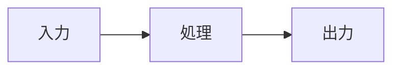

# diary

James Yusuke が書く、Go・Web・設計についての個人技術ブログです。記事はこのGitHubリポジトリでMarkdownとして管理します。`content` 配下は再帰的に読み込まれるため、通常記事は好きなフォルダ構成で整理できます。

## 必要なもの

- Go 1.23 系（ローカル開発とTinyGoビルドで共通）

依存関係はGo moduleで管理しています。初回だけ実行してください。

```sh
go mod download
```

## ローカル起動

```sh
make run
```

ブラウザで `http://localhost:8080` を開きます。ポートを変える場合は `ADDR=:3000 make run` のように指定できます。

## 記事を書く

1. 独自記事は `content/posts/TEMPLATE.md` を複製し、`content` 配下の `zenn/` 以外の任意のフォルダへ配置します。
2. front matter の `slug`、`title`、`summary`、`published_at`、`tags` を設定します。`published_at` は `2026-07-28T14:38:00+09:00` のようなRFC 3339形式を使います。
3. `draft: true` の間は一覧・RSSには出ません。公開するときは削除するか `false` にします。
4. MarkdownをコミットしてGitHubへプッシュします。

記事の一覧、タグ、検索、RSSはfront matterから自動で組み立てられます。不正なメタデータやslugの重複は起動時にエラーになります。

| ソース | 配置場所 | front matter | URL |
| --- | --- | --- | --- |
| 独自記事 | `content/` 配下（`zenn/` 以外） | diary形式（`slug`、`summary`、`tags`、RFC 3339の`published_at`） | `/posts/<slug>` |
| Zenn記事 | `content/zenn/articles/` | Zenn形式（`topics`、`published`、`published_at`） | `/posts/zenn/<slug>` |

Mermaid図は、通常のコードフェンスに `mermaid` を指定して書けます。記事ページではSVG図として描画され、図の描画に失敗したときはコードのまま表示されます。

````markdown

````

## Zenn記事の取り込み

private な [`james-yusuke/zenn`](https://github.com/james-yusuke/zenn) は、Git追跡対象外の `content/zenn` に clone して取り込みます。Cloudflare Workers Builds が private submodule を取得できないため、submodule では管理しません。ローカルでは GitHub へアクセスできる状態で次を実行してください。

```sh
git clone git@github.com:james-yusuke/zenn.git content/zenn
```

`content/zenn/articles` 配下の Markdown だけを、Zenn の front matter として読み込みます。ファイル名が diary 上の slug、`topics` がタグ、本文先頭段落が一覧・RSS用の概要になります。`published: false` は非公開で、公開する記事では `published_at` が必須です。日時が未来の場合は指定時刻まで diary でも公開されません。Zenn記事は一覧・本文で出所を表示し、`/posts/zenn/<slug>` に公開されます。

取り込み漏れを確認するには次を実行します。公開済みの記事はWorkerスナップショット対象、未来日時の記事は予約公開、`published: false` は意図的な下書きとして、全Zenn記事を一覧表示します。公開・予約公開の記事がスナップショット入力から漏れていれば失敗します。

```sh
make zenn-check
```

この監査は、Zenn同期ワークフローとdiary変更時のVerify workflowでも必ず実行されます。

Zenn の `main` で `articles/**` が更新されると、Zenn 側の **Notify diary** workflow が diary の **Sync Zenn content** workflow を即時起動します。通知に含まれるコミットSHAを取得してWorker用スナップショットを再生成し、差分があれば diary 側へ自動コミット・pushします。取りこぼし対策として日次の同期も行います。Worker はこのコミット済みスナップショットを使うため、Cloudflare のビルド環境が private リポジトリへアクセスする必要はありません。公開済みの Worker に private リポジトリの鍵は含まれません。

GitHub Actions では、fine-grained personal access token を発行し、対象リポジトリを `james-yusuke/zenn` のみに絞り、Repository permissions の **Contents: Read-only** だけを許可します。token は diary リポジトリの `ZENN_REPO_TOKEN` Actions Secret に登録します。Zenn 側には、diary リポジトリだけに **Actions: Read and write** を許可した別のtokenを `DIARY_WORKFLOW_TOKEN` として登録します。fork からの pull request では token を使わず、fixture ベースの検証だけが実行されます。同期ワークフローが diary 側の生成済みファイルをpushするため、diary リポジトリの Actions workflow permissions は **Read and write permissions** を許可してください。

Cloudflare の Build command には次を設定します。

```sh
mkdir -p "$HOME/.local" && curl -fsSL https://github.com/tinygo-org/tinygo/releases/download/v0.38.0/tinygo0.38.0.linux-amd64.tar.gz | tar -xz -C "$HOME/.local" && TINYGO="$HOME/.local/tinygo/bin/tinygo" make worker-build
```

## 検証

```sh
make test
make build
```

GitHub Actionsもmainブランチへのpushとpull requestで、templ生成・テスト・ビルドを実行します。

## Cloudflare Workers（TinyGo）

Cloudflare Workersでは実行時にローカルファイルを読めないため、Workerビルド時に `content`、`config/site.yaml`、`assets/site.css` をGoソースへ変換してWasmに含めます。記事の正本は引き続きこのリポジトリのMarkdownです。

必要なもの：

- Go 1.23 系（TinyGo 0.38との互換性のため）
- TinyGo 0.38.0（Go 1.23 系との組み合わせ）
- Binaryen（`wasm-opt`。macOSでは `brew install binaryen`）
- Node.js と `npm install`（WranglerによるローカルWorker実行時のみ）

MarkdownからWorker用コンテンツを更新して成果物を生成します。デプロイは実行しません。

```sh
make GO=go1.23.6 worker-release-build
```

TinyGo 0.41.1 はこの Worker の `net/http` 依存を `-target wasm` でビルドする際に不具合があるため、0.38.0 を使います。Homebrew の最新版を置き換えずに使う場合は、0.38.0 の macOS archive を展開し、次のように実行します。

```sh
TINYGO="$HOME/.local/tinygo/bin/tinygo" make GO=go1.23.6 worker-release-build
```

`worker-build` はコミット済みの生成コンテンツだけを使います。Cloudflare Workers Builds ではこちらを使い、private Zenn リポジトリのcloneやtoken設定は不要です。

`build/app.wasm`、`build/worker.mjs`、`build/wasm_exec.js`、`build/runtime.mjs` がCloudflare Workers用の一式です。Wranglerを利用する場合は、同じGoツールチェーンを選んでから次を実行します。

```sh
GO=go1.23.6 npm run dev
```

`wrangler deploy` は `npm run deploy` として定義していますが、このリポジトリでは実行しません。
