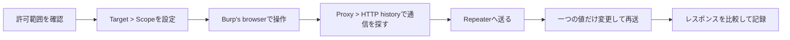

# Burp Suiteの使い方：ProxyとRepeaterでWeb通信を理解する

Burp Suiteは、Webアプリケーションの通信を観察し、必要なリクエストを再送しながら挙動を確かめるためのツールです。ブラウザで画面を操作するだけでは分かりにくい、HTTPリクエストとレスポンスの関係を確認できます。

この記事では、Burp Suiteを初めて使う人に向けて、次の流れを説明します。

- Burp Suiteと各ツールの役割を知る
- 内蔵ブラウザを使って通信を確認する
- 対象範囲（Scope）を先に設定する
- Proxyでリクエストを止め、Repeaterで再送する
- IntruderとScannerを安全な検証環境で使い分ける

> Burp Suiteは、リクエストの変更や大量送信ができるセキュリティテスト用のツールです。自分が管理している環境、契約上の許可を得た環境、またはWeb Security Academyのような専用ラボでだけ使用してください。第三者のサービス、公開サイト、実運用中の本番環境を許可なくテストしてはいけません。

## Burp Suiteとは

Burp Suiteは、ブラウザとWebサーバーの間に入る**インターセプトプロキシ**です。ブラウザが送ったHTTP通信を受け取り、内容を確認してから転送できます。HTTPSの場合も、BurpのCA証明書を適切に信頼させることで、同じように通信を確認できます。

Burp Suiteの特徴は、一つの画面ですべてを自動化することではありません。ブラウザで見つけた通信を別のツールへ渡し、観察、再現、比較という小さな作業を繰り返せることにあります。

| ツール | 役割 | 最初に使う場面 |
| --- | --- | --- |
| Burp's browser | Burp用に設定済みのブラウザ | セットアップ直後の通信確認 |
| Proxy | 通信の中継、停止、変更 | リクエストの実物を見る |
| HTTP history | 通過した通信の履歴 | 後からリクエストを探す |
| Target / Site map | 対象のURLやパスを整理 | アプリの構造を把握する |
| Repeater | リクエストを編集して再送 | 一つの挙動を丁寧に検証する |
| Intruder | 指定位置へ値を変えながら送信 | 許可されたラボで入力値を比較する |
| Decoder | エンコードやデコードを確認 | URL、Base64などの値を読む |
| Comparer | 二つの通信やレスポンスを比較 | 差分を見つける |
| Scanner | クロールと自動監査 | Professionalの検証環境で自動確認する |

Community Editionでも、手動で通信を確認する基本的なワークフローを学べます。Scannerを使った自動スキャンは、公式ドキュメント上、Burp Suite ProfessionalまたはBurp Suite DASTの機能です。エディションによって使える機能や速度が異なるため、必要な機能は利用中のエディションの案内で確認してください。

## 最初に用意するもの

### 1. Burp Suiteを公式サイトからインストールする

PortSwiggerの[ダウンロードページ](https://portswigger.net/burp/downloads)から、自分のOSとCPUに合ったインストーラーを入手します。現在はProfessionalとCommunity Editionでインストーラーが共通化されていますが、インストール後に利用するエディションを選びます。

初めて試すなら、次のどちらかを用意すると安全です。

- 自分のPC上で動かすローカルの検証アプリ
- [Web Security Academy](https://portswigger.net/web-security)の意図的に脆弱なラボ

実際のサービスで試す場合は、所有者からテスト範囲、期間、許可された操作、負荷の上限を明文化してもらいましょう。「ログインできるから試してよい」「公開されているから試してよい」ということにはなりません。

### 2. まずはBurp's browserを使う

Burpを起動したら、`Proxy` > `Intercept`を開き、`Open browser`をクリックします。Burp's browserはBurp Proxyを使うための設定が済んでいるため、外部ブラウザのプロキシ設定やCA証明書のインストールを先に行う必要がありません。

初回は外部ブラウザではなく、この内蔵ブラウザを使うのがおすすめです。ブラウザ側のプロキシ設定とBurp側のリスナー設定を同時に切り分けなくてよいためです。

### 3. 外部ブラウザを使う場合

FirefoxやChromeなどを使う必要がある場合は、次の二つを設定します。

1. ブラウザのHTTPプロキシをBurpのリスナーへ向ける
2. BurpのCA証明書を、そのブラウザ専用プロファイルの信頼ストアへ登録する

標準設定では、Burpはローカルホストの `127.0.0.1:8080` でリスナーを起動します。ただし、ポートは設定で変更できるため、`Proxy`のリスナー設定で実際の値を確認してください。

HTTPSを確認するには、Burpのブラウザで `http://burpsuite` を開くか、外部ブラウザをBurpへ接続した状態でCA証明書をダウンロードします。CA証明書の秘密鍵は、HTTPS通信を中間者として扱える重要な情報です。エクスポートした秘密鍵を共有したり、普段使いのブラウザへ漫然と登録したりしないでください。検証が終わったら、証明書とプロキシ設定を削除します。

## Burp Suiteの基本ワークフロー

Burp Suiteでは、次の順番を守ると事故を減らせます。



いきなりIntruderやScannerを実行するのではなく、まずブラウザで通常の操作を行い、どのリクエストがどの画面や機能に対応するのかを理解します。

## 1. Target > Scopeを設定する

Burp Suiteを使うと、ブラウザが読み込む画像、フォント、広告、分析サービスなど、対象外の通信も履歴に入ります。そこで、最初にテスト対象をScopeへ登録します。

`Target` > `Scope`で対象URLを追加するか、`Target`のSite mapまたは`Proxy`のHTTP historyで対象の項目を選び、コンテキストメニューからScopeへ追加します。

例えば、ローカルの検証アプリだけを対象にするなら、次のような狭い範囲から始めます。

```text
http://localhost:3000
```

サブドメインをまとめて含める設定は便利ですが、意図せず対象を広げます。特に、`example.com`全体や「すべてのサブドメイン」を最初から対象にするのは避け、許可されたホストとパスだけを追加してください。

Scopeには、次のような効果があります。

- Site mapやHTTP historyを対象内だけに絞って表示できる
- Proxyで対象内の通信だけをログに残す、またはInterceptする設定にできる
- RepeaterやIntruderでリダイレクトを対象範囲に限定しやすい
- Professionalでは、自動スキャンの範囲を明確にできる

Scopeは「表示を見やすくするためのフィルター」だけではありません。対象外へ意図せずリクエストを送る可能性を下げるための安全装置でもあります。ただし、Scopeを設定しただけで操作が完全に無害になるわけではないため、許可範囲の確認は別に必要です。

## 2. Proxyでリクエストを確認する

### Interceptの使い方

Burp's browserでScope内のサイトを開くと、通信がBurpを通ります。`Proxy` > `Intercept`で`Intercept on`にすると、リクエストがサーバーへ届く前に止まります。

止めたリクエストには、次の操作ができます。

- `Forward`：そのままサーバーへ送る
- `Drop`：送らずに破棄する
- エディターで内容を変更してから`Forward`する
- 右クリックしてRepeaterやIntruderなどへ送る

ブラウザは、HTMLだけでなくCSS、JavaScript、画像、faviconなども短時間に大量に要求します。すべての通信を止めると操作しづらくなるため、通常の閲覧では`Intercept off`にしておき、必要なリクエストだけHTTP historyから選ぶ方法が実用的です。

### HTTP historyで後から探す

`Proxy` > `HTTP history`には、Burpを通過したHTTP通信が並びます。Interceptをオフにしている間の通信も履歴に残るため、まず画面を普通に操作し、後で対応するリクエストを選ぶことができます。

確認したい項目は次のとおりです。

- HTTPメソッド：`GET`、`POST`、`PUT`、`DELETE`など
- パスとクエリ：`/search?q=burp`のようなURL部分
- リクエストヘッダー：`Cookie`、`Authorization`、`Content-Type`など
- リクエストボディ：フォーム、JSON、GraphQLなどの入力値
- ステータスコード：`200`、`302`、`400`、`401`、`403`、`500`など
- レスポンスの長さ、ヘッダー、本文

HTTPリクエストは、例えば次のような形です。

```http
GET /search?q=burp HTTP/1.1
Host: lab.example.test
Accept: text/html
Cookie: session=<検証用セッション>
```

この例では、`q`が検索語、`Cookie`がログイン状態に関係する値です。Cookieやトークンは機密情報なので、記事、Issue、スクリーンショット、共有ファイルへ貼るときは必ずマスクします。

## 3. Repeaterで一つのリクエストを再送する

Repeaterは、興味のあるHTTPまたはWebSocketメッセージを編集し、何度も再送するためのツールです。Burp Suiteを学ぶうえで、最も使用頻度の高い機能の一つです。

### 基本操作

1. `Proxy` > `HTTP history`で対象のリクエストを選ぶ
2. 右クリックして`Send to Repeater`を選ぶ
3. `Repeater`タブで変更したい値を一つだけ編集する
4. `Send`をクリックする
5. ステータス、レスポンス長、ヘッダー、本文を元のレスポンスと比較する

例えば、ローカルの検索画面から次のリクエストが記録されたとします。

```http
GET /search?q=burp HTTP/1.1
Host: localhost:3000
```

Repeaterで `q=burp` を `q=proxy` に変え、画面の表示、ステータスコード、レスポンス本文を比べます。ここで重要なのは、最初から複数のパラメータやヘッダーを一度に変えないことです。変更を一つに絞ると、どの入力が結果に影響したのかを説明できます。

JSON APIを確認するときも同じです。

```http
POST /api/profile HTTP/1.1
Host: localhost:3000
Content-Type: application/json

{"displayName":"alice"}
```

検証用のアカウントで `displayName` だけを変更してレスポンスを確認します。ログインが必要なアプリでは、セッションCookieやCSRFトークンが期限切れになっていないかにも注意してください。Repeaterに送ったリクエストが、ブラウザで今も有効なセッションを持っているとは限りません。

### Repeaterで見るべき差分

単にレスポンスが返ったかだけでなく、次の差分を見ます。

- ステータスコードが変わったか
- レスポンス本文に含まれるメッセージが変わったか
- レスポンス長が変わったか
- `Location`、`Set-Cookie`、`Content-Type`などが変わったか
- 認証状態や表示されるユーザーが変わったか
- サーバー側のエラーが出ていないか

レスポンス長の差は手掛かりにはなりますが、それだけで脆弱性の証明にはなりません。正常系、境界値、無効値を比較し、再現条件と影響を記録します。

## 4. Intruderで入力値を比較する

Intruderは、指定した位置へ複数の値を順番に入れてリクエストを送る機能です。入力値の違いによるレスポンスの差を調べるときに役立ちます。

使い方の基本は次のとおりです。

1. HTTP historyまたはRepeaterからリクエストをIntruderへ送る
2. 変更したい値を選び、Payload positionを設定する
3. 少数の検証用Payloadを用意する
4. レートや同時実行数を対象環境に合わせる
5. ステータス、長さ、本文の差を確認する

例えば、許可されたローカルラボの検索パラメータで、次のような小さなリストを使います。

```text
burp
proxy
test
```

Intruderの攻撃タイプは、目的に応じて選びます。

| 攻撃タイプ | 概要 | 使いどころの例 |
| --- | --- | --- |
| Sniper | 一つのPayload集合を、各位置へ順番に入れる | パラメータを一つずつ比較する |
| Battering ram | 同じPayloadを複数位置へ同時に入れる | 同じ値の反映箇所を確認する |
| Pitchfork | 複数のPayload集合を同じ行番号で組み合わせる | 対応する入力を組み合わせる |
| Cluster bomb | Payload集合の組み合わせを試す | ラボで複数入力の組み合わせを調べる |

Intruderは、実在ユーザーの認証情報を試すための道具ではありません。認証情報の推測、識別子の列挙、大量のリクエストは、許可のない対象に対して重大な影響を与えます。練習ではWeb Security Academyなどのラボを使い、少数のPayload、低い負荷、明確な終了条件で実行してください。

## 5. ProfessionalのScannerを使うとき

Burp Scannerは、対象のコンテンツをクロールするフェーズと、通信や挙動を監査するフェーズを組み合わせたDAST（動的アプリケーションセキュリティテスト）用のスキャナーです。公式ドキュメントでは、デスクトップ版のScannerはProfessionalで提供されています。

Professionalで検証用サイトをスキャンする場合は、次の順番にします。

1. Target > Scopeで対象を確認する
2. Dashboardで`New scan`を開く
3. URL、ログイン、クロール範囲、負荷を確認する
4. まず軽い設定や小さな範囲で実行する
5. 検出結果をRepeaterで再現する
6. 誤検知を除外し、影響と再現手順を人間が確認する

Scannerの結果は、そのまま脆弱性の確定報告ではありません。自動スキャンはアプリケーションの状態を変えたり、想定以上のリクエストを送ったりすることがあります。バックアップ、メンテナンス時間、テスト用データ、レート制限を用意し、許可された非本番環境から始めてください。

## よくあるつまずき

### ページが読み込まれない

まず`Proxy` > `Intercept`を`off`にします。Interceptがオンのまま複数のリクエストを止めていると、ブラウザからは「サイトが壊れた」ように見えます。それでも解決しない場合は、次を確認します。

- BurpのProxy listenerがRunningになっているか
- ブラウザが正しいアドレスとポートを使っているか
- ほかのアプリがポート8080を使っていないか
- ScopeやHTTP historyの表示フィルターで隠れていないか

### HTTPSで証明書エラーが出る

Burp's browserなら、通常は追加のCA設定は不要です。外部ブラウザの場合は、BurpのCA証明書を検証専用プロファイルへインストールし、Burpを経由しているかを確認します。普段のブラウザへ証明書を登録したままにしないことが重要です。

### リクエストが履歴に見つからない

ブラウザがBurpを使っていない、Proxy historyの表示フィルターが有効、対象がScope外、という可能性があります。まずBurp's browserで同じ操作を再現し、表示フィルターを解除してから確認します。

### Repeaterでログイン状態が再現できない

Cookie、Authorizationヘッダー、CSRFトークン、OriginやRefererなど、アプリが検証している値を確認します。トークンを手作業で更新する必要があるアプリでは、同じ検証用セッションでログイン操作をやり直します。実ユーザーのセッション情報をコピーして使うのは避けてください。

### アプリの動作を壊してしまいそう

ProxyのInterceptをオフにし、範囲をローカルの検証環境へ戻します。入力を変更する検証は、最初から状態をリセットできるテストデータで行い、決済、削除、メール送信、パスワード変更などの副作用がある機能は、テスト専用の代替処理を用意してから確認します。

## 安全に使うためのチェックリスト

実際にBurp Suiteを使う前に、次を確認します。

- [ ] 対象の所有者と、テストの許可範囲を確認した
- [ ] 本番ではなく、ローカルまたは検証用環境を使っている
- [ ] Target > Scopeに許可されたホストとパスだけを登録した
- [ ] 通常のブラウジング中はInterceptをオフにした
- [ ] IntruderやScannerのリクエスト量・終了条件を決めた
- [ ] テスト用アカウントとテスト用データを使っている
- [ ] Cookie、トークン、個人情報を記録からマスクした
- [ ] 変更したデータを元に戻す手順を用意した
- [ ] 結果を、リクエスト・レスポンス・再現条件・影響とともに記録した

## まとめ

Burp Suiteを使い始めるときは、機能を片端から試すより、次の流れを覚えると理解しやすくなります。

1. 許可範囲を確認する
2. Target > Scopeを狭く設定する
3. Burp's browserで通常の操作を行う
4. HTTP historyから対象の通信を探す
5. Repeaterで一つの値だけ変更して再送する
6. 必要な場合だけIntruderやScannerを、負荷と範囲を管理しながら使う
7. 結果を再現可能な形で記録する

特に大切なのは、Burp Suiteを「攻撃ボタン」として扱わず、Webアプリケーションがどのリクエストを受け取り、どのレスポンスを返すのかを調べる観察ツールとして使うことです。HTTPの一往復を読み解けるようになると、認証、入力値、セッション、APIの挙動をより正確に考えられるようになります。

## 参考資料

- [Burp Suiteを使い始める（PortSwigger公式）](https://portswigger.net/burp/documentation/desktop/getting-started)
- [Burp Proxy（PortSwigger公式）](https://portswigger.net/burp/documentation/desktop/tools/proxy)
- [対象範囲（Scope）の設定（PortSwigger公式）](https://portswigger.net/burp/documentation/desktop/tools/target/scope)
- [Burp Repeater（PortSwigger公式）](https://portswigger.net/burp/documentation/desktop/tools/repeater)
- [CA証明書の管理（PortSwigger公式）](https://portswigger.net/burp/documentation/desktop/tools/proxy/manage-certificates)
- [Burp Scanner（PortSwigger公式）](https://portswigger.net/burp/documentation/scanner)
- [Web Security Academy（PortSwigger公式）](https://portswigger.net/web-security)
